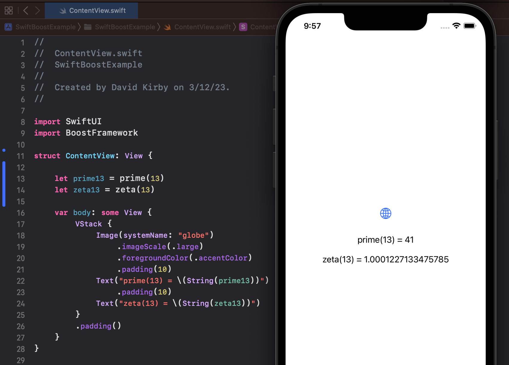
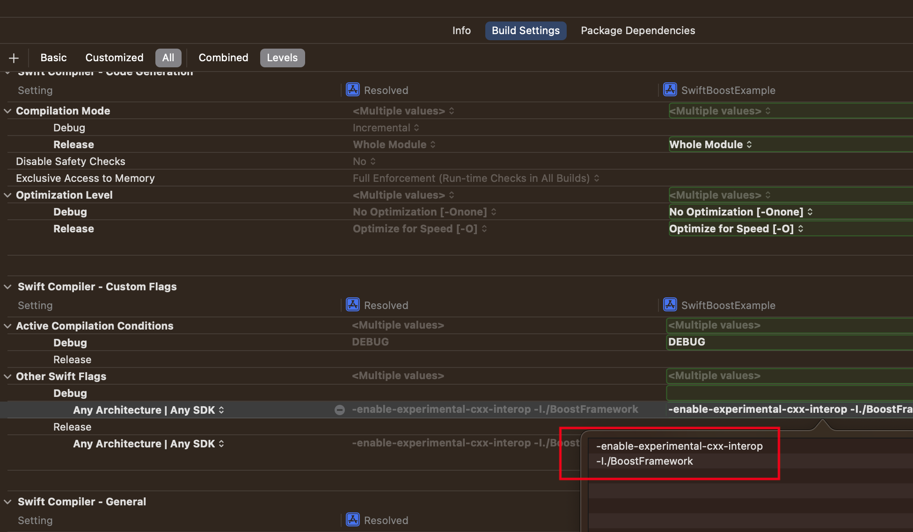
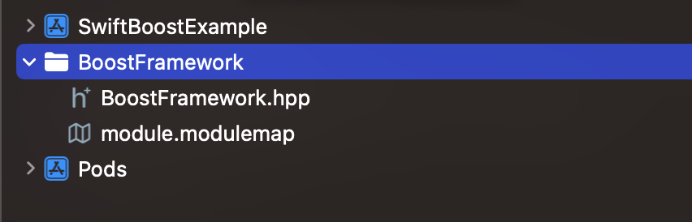

# SwiftBoostExample

I'm new to Swift and it wasn't immediately clear how to easily import and use Boost Framework functions, so here's a very basic example for anyone else wanting to do this. 



## Requirements

* Xcode
* Swift 5.7+

## Additional Notes

* This method uses the `-enable-experimental-cxx-interop` flag which will likely be superseded by `-cxx-interoperability-mode=swift-5.9` when Swift 5.9 is officially released
 
* For more information regarding **experimental** Swift C++ interoperability see archived README here: <a href="https://github.com/apple/swift/blob/05d44b128f1f45cdcf58ebb8df32d223390f6798/docs/CppInteroperability/GettingStartedWithC%2B%2BInterop.md" target="_blank">https://github.com/apple/swift/blob/05d44b128f1f45cdcf58ebb8df32d223390f6798/docs/CppInteroperability/GettingStartedWithC++Interop.md</a>

* For more information regarding **production-ready** Swift C++ interopablility see current README here: <a href="https://github.com/apple/swift/blob/main/docs/CppInteroperability/GettingStartedWithC%2B%2BInterop.md" target="_blank">https://github.com/apple/swift/blob/main/docs/CppInteroperability/GettingStartedWithC++Interop.md</a>

* For details about Swift 5.9 see release announcement here: <a href="https://forums.swift.org/t/swift-5-9-release-process/63557" target="_blank">https://forums.swift.org/t/swift-5-9-release-process/63557</a>

## Quick Start

* Clone the repository
* Load the included Workspace in Xcode: `./SwiftBoostExample.xcworkspace`
* Update signing & capabilities if needed
* Select destination
* And run!


<br>


## Reference

### Installing Boost via CocoaPods (optional)

I found it easiest to install Boost using CocoaPods since it automatically creates a Workspace and `.xconfig` file with the appropriate header search paths. Here's how to do that:

* Install CocoaPods. See instructions here: <a href="https://cocoapods.org/" target="_blank">https://cocoapods.org/</a>
* Create a `Podfile` with the following contents:

```
target 'SwiftBoostExample' do
  use_frameworks!
  pod 'boost', '~> 1.51.0'
end
```
* Open terminal and run `pod install` in the repository root. It may take a very long time to complete the first time.


(*Note: Boost 1.51 is rather old but other pod versions were throwing errors during compilation due to missing includes in the podspec. See <a href="https://github.com/CocoaPods/Specs/tree/master/Specs/9/9/d/boost" target="_blank">https://github.com/CocoaPods/Specs/tree/master/Specs/9/9/d/boost</a> for available podspec versions*)

### Updating compiler flags

* Add the following flags to `Build Settings -> Other Swift Flags`:

```
-enable-experimental-cxx-interop
-I./BoostFramework
```



* If you didn't install with CocoaPods then you also need to add the Boost path to `Build Settings -> Swift Compiler - Search Paths -> Import Paths`

### Create BoostFramework group, header and modulemap



#### `BoostFramework.hpp` example

```
#ifndef BoostFramework_hpp
#define BoostFramework_hpp

#define BOOST_NO_EXCEPTIONS

#include <stdio.h>
#include <boost/math/special_functions/prime.hpp>
#include <boost/math/special_functions/zeta.hpp>
#include <boost/throw_exception.hpp>

uint32_t prime(uint32_t n) {
    return boost::math::prime(n - 1);
}

double zeta(double z) {
    return boost::math::zeta(z);
}

void boost::throw_exception(std::exception const & e){
  //TODO: handle exception
}

#endif /* BoostFramework_hpp */
```

#### `module.modulemap`

```
module BoostFramework {
    header "BoostFramework.hpp"
    requires cplusplus
}
```


